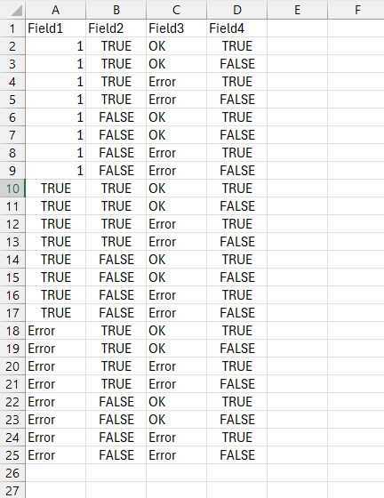

# Permutations to CSV

This script generates all permutations of user-defined fields with variable values and saves the results in a CSV file.



- Make sure [Node.js](https://nodejs.org/) is installed on your machine.

---

## Usage
1. Clone or download the script file (`permutate.js`).
2. Define the fields and their possible values in the script:
   ```javascript
   const fields = [
       ['Field1', [100, true, 'OK']],
       ['Field2', [true, false]],
       ['Field3', ['OK', 'Error']],
       ['Field4', [true, false]],
   ];
3. Run in terminal like this
```bash
node permutate.js output.csv